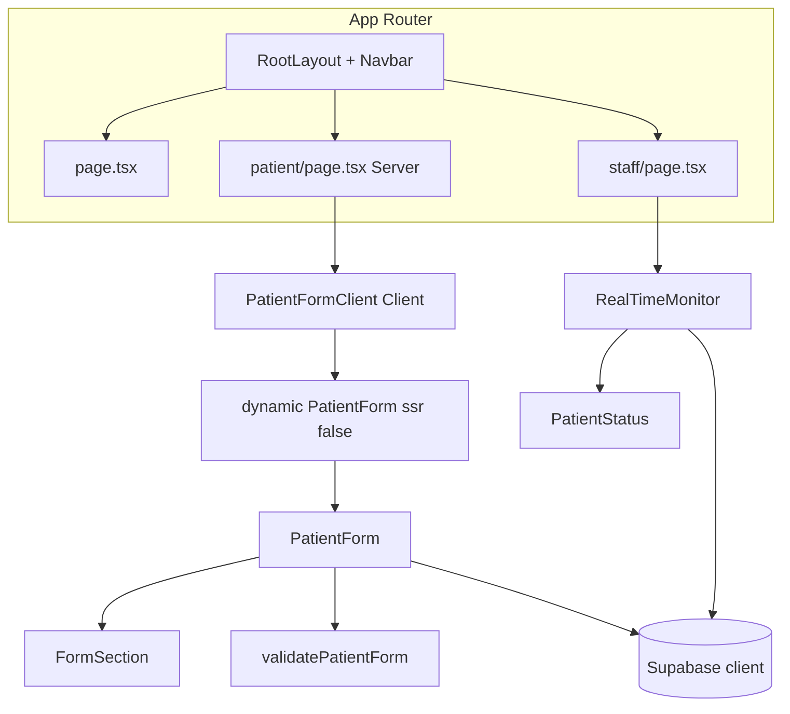

# Development Planning

เอกสารนี้สรุปการออกแบบโปรเจกต์ตามที่ใช้ส่งงาน: โครงสร้างโฟลเดอร์, การตัดสินใจ UI/UX (มือถือ vs เดสก์ท็อป), สถาปัตยกรรมคอมโพเนนต์ และ flow ของระบบ Real-time

---

## 1. โครงสร้างโฟลเดอร์

โปรเจกต์ใช้แนว **Next.js App Router** โดยรวมโค้ดแอปไว้ใต้ `src/` เพื่อแยกชัดจากไฟล์ config ที่รากโปรเจกต์

```
src/
├── app/                    # เส้นทาง (routes) และ layout ระดับ root
│   ├── layout.tsx          # Navbar ทุกหน้า, lang=th, overflow-x-hidden
│   ├── globals.css         # สไตล์ global + Tailwind
│   ├── page.tsx            # หน้าแรก — ลิงก์ไป Patient / Staff
│   ├── patient/page.tsx    # หน้าคนไข้ (Server Component) — เรนเดอร์ PatientFormClient
│   └── staff/page.tsx      # หน้าเจ้าหน้าที่ — เรนเดอร์ RealTimeMonitor
├── components/
│   ├── navbar/             # แถบนำทางร่วมทุกหน้า
│   ├── patient/            # UI โดเมนคนไข้
│   │   ├── PatientFormClient.tsx  # Client: next/dynamic(ssr:false) ห่อ PatientForm
│   │   ├── PatientForm.tsx        # ฟอร์ม + realtime + validation
│   │   └── FormSection.tsx
│   ├── staff/              # UI โดเมนเจ้าหน้าที่ (มอนิเตอร์, สถานะ)
│   └── ui/                 # คอมโพเนนต์ UI ทั่วไป (เช่น Button จาก shadcn)
├── lib/                    # ฟังก์ชันช่วย — ไม่ผูกกับ React โดยตรง
│   ├── supabase.ts         # สร้าง Supabase client จาก env
│   ├── validatePatientForm.ts  # กฎ validation + normalize เบอร์ไทย
│   └── utils.ts            # utility ทั่วไป (cn ฯลฯ)
└── types/                  # ชนิดข้อมูลที่แชร์ระหว่าง patient / staff
    └── index.ts
```

**เหตุผลสั้น ๆ**

- **`app/`** บางที่สุด: แต่ละ route นำเข้าแค่ “หน้าจอหลัก” ของโดเมนนั้น ไม่ยัด business logic ยาวใน `page.tsx`
- **หน้า `/patient`:** `page.tsx` ยังเป็น **Server Component**; การใช้ `next/dynamic({ ssr: false })` ต้องอยู่ใน **Client Component** จึงแยกเป็น `PatientFormClient.tsx` (ข้อกำหนด Next.js 16)
- **`components/patient` vs `components/staff`** แยกตามบทบาทผู้ใช้ ทำให้หาไฟล์และขยายฟีเจอร์ฝั่งใดฝั่งหนึ่งได้ง่าย
- **`lib/`** รวม validation และ client — ทดสอบและอ่านกฎฟอร์มได้โดยไม่ต้องเปิด JSX
- **`types/`** กำหนดรูปแบบข้อมูลที่ broadcast / submit ใช้ร่วมกัน ลดการพิมพ์ `any` และให้ Staff view สอดคล้องกับข้อมูลจากฟอร์ม

---

## 2. การตัดสินใจด้าน UI/UX (Mobile vs Desktop)

### หน้าแรก (`/`)

- **มือถือ:** ปุ่ม “คนไข้” และ “เจ้าหน้าที่” เรียง **แนวตั้ง** (`flex-col`) เต็มความกว้าง — นิ้วโป้งกดง่าย ไม่แออัด
- **Desktop (`sm` ขึ้นไป):** สลับเป็น **แนวนอน** (`sm:flex-row`) ใช้พื้นที่กว้าง มองเป็นคู่ตัวเลือกชัดเจน
- ปุ่มหลักใช้ gradient ให้รู้ว่าเป็น path หลักของคนไข้; ปุ่มรองเป็น outline/พื้นอ่อน เพื่อลำดับความสำคัญภาพ (primary vs secondary)

### Navbar

- **มือถือ:** โลโก้ + ชื่ออยู่บรรทัดบน, แถบลิงก์อยู่ล่าง (`flex-col`) — ไม่บีบข้อความในแนวแคบ
- **Desktop:** แถวเดียว (`sm:flex-row`) โลโก้ซ้าย นำทางขวา
- ลิงก์เป็น **pill** ในแทร็กสีอ่อน: แตะง่าย, สถานะ active ชัด (พื้น gradient)

### ฟอร์มคนไข้ (`PatientForm`)

- ช่องกรอกใช้ **`min-h-[44px]`** และ `text-base` — เป้าแตะตามแนวทาง accessibility บนมือถือ และลดการซูมอัตโนมัติในบางเบราว์เซอร์
- Section แยกด้วยหัวข้อ + ไอคอน (Lucide) ให้อ่านเป็นขั้นตอน ไม่เป็นผนัง input ยาว
- ปุ่มส่งในมุมมองแคบเน้น **เต็มความกว้าง** ที่ breakpoint เล็ก (ถ้ามีในฟอร์ม) เพื่อลดความผิดพลาดตอนแตะ

### มอนิเตอร์เจ้าหน้าที่ (`RealTimeMonitor`)

- การ์ดสถิติ: บนมือถือใช้ **grid 2 คอลัมน์** แล้วขยายเป็น 4 คอลัมน์บนจอใหญ่ — ยังอ่านตัวเลขได้โดยไม่ต้องเลื่อนแนวนอน
- รายการผู้ป่วย: **1 คอลัมน์บนมือถือ** → `md`/`lg` เพิ่มเป็น 2–3 คอลัมน์ เหมาะกับจอมอนิเตอร์
- `overflow-x-hidden` ที่ layout ระดับ root ช่วยกันแถบเลื่อนแนวนอนเกินจอบนมือถือ

หลักคิดรวม: **มือถือ = แตะง่าย, เรียงแนวตั้ง, ตัวใหญ่พอสมควร** — **เดสก์ท็อป = ใช้ความกว้าง, หลายคอลัมน์, ลดความสูงของหน้า**

---

## 3. สถาปัตยกรรมคอมโพเนนต์



- **`RootLayout`:** shell ทั้งแอป — ภาษาไทย, พื้นหลัง, **Navbar** คงที่
- **หน้า route:** ทำหน้าที่เป็น **composition root** เท่านั้น (import คอมโพเนนต์ใหญ่หนึ่งตัว)
- **`PatientFormClient`:** Client Component เดียวที่เรียก `next/dynamic(..., { ssr: false })` — ใน Next.js 16 ไม่อนุญาตให้ใช้ `ssr: false` ใน Server Component โดยตรง
- **`PatientForm` (โหลดฝั่ง client เท่านั้น):** state ฟอร์ม, validation, debounce, subscribe channel, ส่ง broadcast, กิจกรรมผู้ใช้ (เมาส์/คีย์บอร์ด) และ inactive timer  
  - **เหตุผล `ssr: false`:** กัน **hydration mismatch** เมื่อส่วนขยายเบราว์เซอร์ฉีด attribute ลง `<input>` / `<button>` (เช่น `fdprocessedid`) บน HTML จากเซิร์ฟเวอร์ก่อน React hydrate — ฟอร์มจึงถูกสร้างครั้งแรกบน client เท่านั้น (มี fallback “กำลังโหลดฟอร์ม…” ช่วงสั้น ๆ)
- **`FormSection`:** wrapper หัวข้อของฟอร์ม — ลดซ้ำใน JSX
- **`RealTimeMonitor`:** subscribe channel เดียวกัน, รวม state `patients` เป็น map, แสดงการ์ดและตัวเลขสรุป
- **`PatientStatus`:** แสดงป้ายสถานะ (active / inactive / submitted) แยกเป็นคอมโพเนนต์เล็ก อ่านง่าย
- **`lib/validatePatientForm`:** กฎธุรกิจฟอร์มอยู่นอก React — submit และ blur เรียกใช้ชุดเดียวกัน

---

## 4. Flow การทำงานของระบบ Real-time

### เทคโนโลยี

ใช้ **Supabase Realtime — Broadcast** บน **channel เดียว** ชื่อ `patient-room` ทั้งฝั่งคนไข้และเจ้าหน้าที่จึงอยู่ “ห้อง” เดียวกัน ไม่ต้องมีตารางในฐานข้อมูลสำหรับข้อความแต่ละครั้ง (เหมาะกับ demo และ latency ต่ำ)

### ฝั่งคนไข้ (`PatientForm`)

1. **สมัคร channel** เมื่อโหลดคอมโพเนนต์
2. เมื่อสถานะ `SUBSCRIBED` → ส่ง **`patient-status`** (`active`) เพื่อให้ staff เห็นว่ามี session
3. เมื่อฟอร์มเปลี่ยน → เก็บ snapshot เป็น JSON → **debounce ~500ms** → ถ้าค่าเปลี่ยนจริงจากครั้งส่งล่าสุด → ส่ง **`patient-update`** พร้อม object ฟอร์มทั้งก้อน  
   - ลดภาระเครือข่ายเมื่อเทียบกับส่งทุก keystroke โดยตรง แต่ยังคงความรู้สึก “เกือบเรียลไทม์”
4. เมื่อมีการขยับ (คลิก, พิมพ์, scroll, touch) → ส่ง **`patient-activity`** และอัปเดตเวลากิจกรรมล่าสุดภายในเครื่อง
5. ถ้าเงียบเกิน ~30 วินาที → ส่ง **`patient-status`** (`inactive`)
6. เมื่อกดส่งและผ่าน validation → ส่ง **`patient-submit`** พร้อมข้อมูลที่ normalize แล้ว (เช่น เบอร์)

### ฝั่งเจ้าหน้าที่ (`RealTimeMonitor`)

1. สมัคร channel **`patient-room`** เช่นกัน
2. รับ broadcast ตาม event:
   - **`patient-status`** → อัปเดต `status` + `lastActivity`
   - **`patient-activity`** → ตั้ง `active` + `lastActivity`
   - **`patient-update`** → แทนที่ `data` ด้วย snapshot ล่าสุดของฟอร์ม
   - **`patient-submit`** → ตั้ง `submitted`, เก็บ `submittedAt`, อัปเดต `data`
3. UI อ่านจาก state `patients` (key = `patientId`) แล้วเรนเดอร์การ์ดและตัวเลขสรุป

### สรุปเป็นขั้นตอนเดียว

**คนไข้แก้ฟอร์ม → debounce → broadcast `patient-update` → เจ้าหน้าที่ merge เข้า state → การ์ดแสดงข้อมูลใหม่**  
ควบคู่กับ **status / activity / submit** เพื่อให้ครบตาม indicator ที่โจทย์ต้องการ (กำลังกรอก / หยุด / ส่งแล้ว)

---

## ข้อจำกัดที่ยอมรับใน scope นี้

- `patientId` คงที่ในตัวอย่าง (เช่น `patient-1`) — เหมาะกับ demo หนึ่งคนไข้ต่อหนึ่งแท็บ; ระบบจริงอาจสร้าง id ต่อ session
- Real-time ผ่าน broadcast ไม่ได้ persist ลง DB ในโปรเจกต์นี้ — ข้อมูลหายเมื่อรีเฟรชหน้า staff ถ้าไม่มีแหล่งเก็บถาวล
- หน้าฟอร์มคนไข้ **ไม่ได้พึ่ง SEO จากเนื้อหาฟอร์ม** — การไม่ SSR ฟอร์มจึงยอมรับได้; ถ้าต้องการ SSR เนื้อหาสาธารณะในอนาคต แยกเป็นหน้า landing ที่เป็น Server Component ได้

เอกสารนี้ใช้คู่กับ **README** สำหรับการติดตั้งและรันโปรเจกต์
